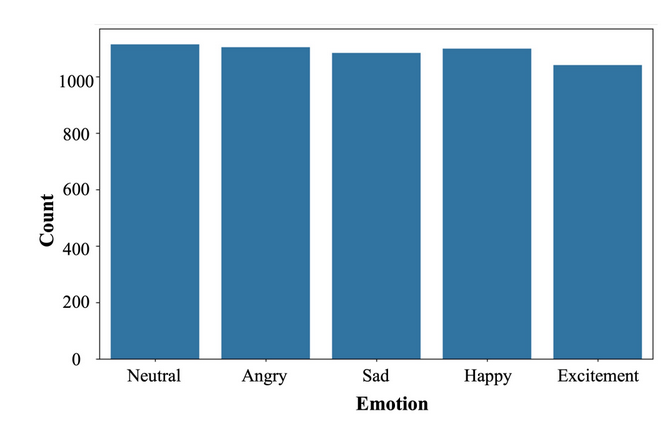
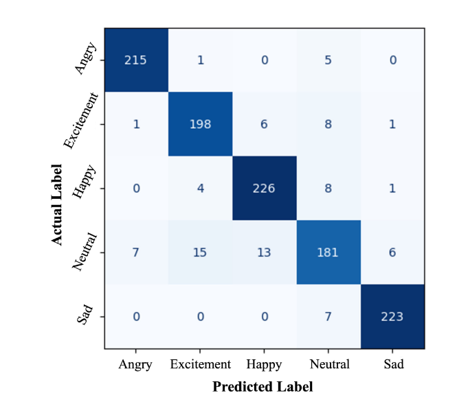

# EmoTech: A Multi-modal Speech Emotion Recognition Using Multi-source Low-level Information with Hybrid Recurrent Network

Emotion recognition is a critical task in human-
computer interaction, enabling more intuitive and responsive
systems. This study presents a multimodal emotion recognition
system that combines low-level information from audio and text,
leveraging both Convolutional Neural Networks (CNNs) and
Bidirectional Long Short-Term Memory Networks (BiLSTMs).
The proposed system consists of two parallel networks: an Audio
Block and a Text Block. Mel Frequency Cepstral Coefficients
(MFCCs) are extracted and processed by a BiLSTM network
and a 2D convolutional network to capture low-level intrinsic
and extrinsic features from speech. Simultaneously, a combined
BiLSTM-CNN network extracts the low-level sequential nature
of text from word embeddings corresponding to the available
audio. This low-level information from both speech and text is
then concatenated and processed by several fully connected layers
to classify the speech emotion. Experimental results demonstrate
that the proposed EmoTech accurately recognizes emotions from
combined audio and text inputs, achieving an overall accuracy of
84%. This solution outperforms previously proposed approaches
for the same dataset and modalities.

## Dataset and Data Preprocessing

  
   <em>The statistics of ten classes in IEMOCAP Dataset before augmentation</em>

  
   <em>The statistics of five dominated classes in IEMOCAP Dataset after augmentation</em>

## Methodology

  
   <em>Basic block diagram of the proposed EmoTech Architecture</em>

  
   <em>A detail block diagram of audio signal processing in EmoTech</em>

  
   <em>A detail block diagram of text data processing in EmoTech</em>

  
   <em>A detail block diagram of classification processing in EmoTech</em>

## Results 

  
   <em>The impact of data augmentation on accuracy</em>

  
   <em>Different classification metrics for individual classes</em>

  
   <em>Confusion Matrix in classifying five emotion using EmoTech architecture</em>

  
   <em>Comparison of different algorithms in SER</em>

