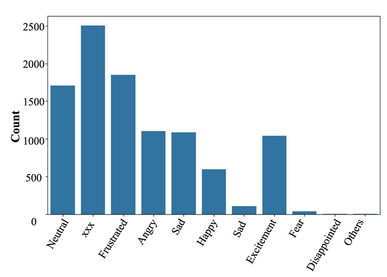

# EmoTech: A Multi-modal Speech Emotion Recognition Using Multi-source Low-level Information with Hybrid Recurrent Network

Emotion recognition is a critical task in human-
computer interaction, enabling more intuitive and responsive
systems. This study presents a multimodal emotion recognition
system that combines low-level information from audio and text,
leveraging both Convolutional Neural Networks (CNNs) and
Bidirectional Long Short-Term Memory Networks (BiLSTMs).
The proposed system consists of two parallel networks: an Audio
Block and a Text Block. Mel Frequency Cepstral Coefficients
(MFCCs) are extracted and processed by a BiLSTM network
and a 2D convolutional network to capture low-level intrinsic
and extrinsic features from speech. Simultaneously, a combined
BiLSTM-CNN network extracts the low-level sequential nature
of text from word embeddings corresponding to the available
audio. This low-level information from both speech and text is
then concatenated and processed by several fully connected layers
to classify the speech emotion. Experimental results demonstrate
that the proposed EmoTech accurately recognizes emotions from
combined audio and text inputs, achieving an overall accuracy of
84%. This solution outperforms previously proposed approaches
for the same dataset and modalities.

## Dataset and Data Preprocessing

## Methodology

## Results 

